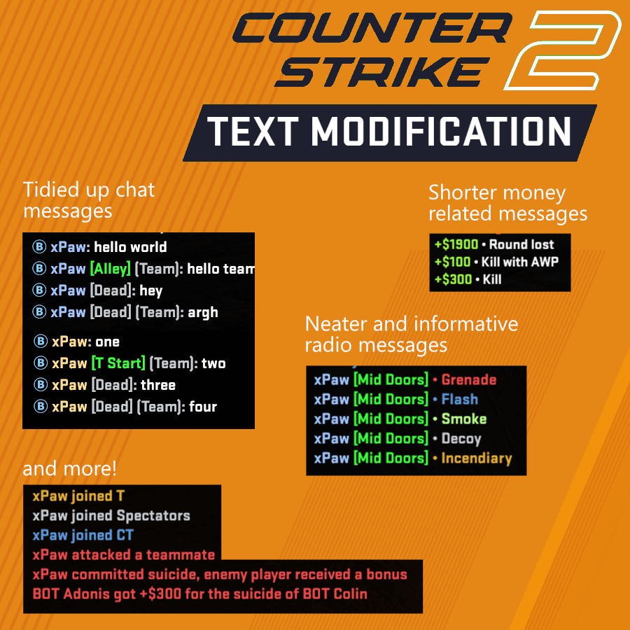

# 如何使用CS2彩色提示

1. [点击此链接下载文件](https://raw.githubusercontent.com/2233admin/CS2-stuff-CN/main/csgo_textModeCN.txt) (Press <kbd>Ctrl+S</kbd>)
2. 将此文件保存为 `csgoo_textmod.txt` 并放入此文件夹中 `Steam\SteamApps\Common\Counter-Strike Global Offensive\game\csgo\resource`
3. 将 `-language textmod` 添加到启动选项中

#### 不管用？请确保
- csgo_textmod.txt "放在正确的文件夹中（需要放在 CS2 的 "game\csgo\resource "文件夹中）。
- 启动选项的拼写是否正确，下面是一个可以正常工作的示例： novid -language textmod
- 如果界面是英文的只有投掷物是中文
需要把 csgoo_textmod.txtSteam\SteamApps\Common\Counter-Strike Global Offensive\game\csgo\resource 
文件夹下  把 csgo_english.txt 文件名修改成csgo_english1.txt 然后把
csgo_schinese.txt文件名修改成csgo_english.txt即可解决这个问题。

要为队友颜色启用圆圈内的字母，请使用cl_teammate_colors_show 2

这是基于 bananagaming 文字修改器制作的 cs2版本

----

# 安装跑图CFG方式

1. [点击此链接下载文件](https://raw.githubusercontent.com/xPaw/CS2/main/cs2practice.cfg) (Press <kbd>Ctrl+S</kbd>)
2. 将此文件保存为`practice.cfg`，并放入此文件夹 `Steam\SteamApps\Common\Counter-Strike Global Offensive\game\csgo\cfg`
3. 本地加载地图
4. `exec practice` in console
